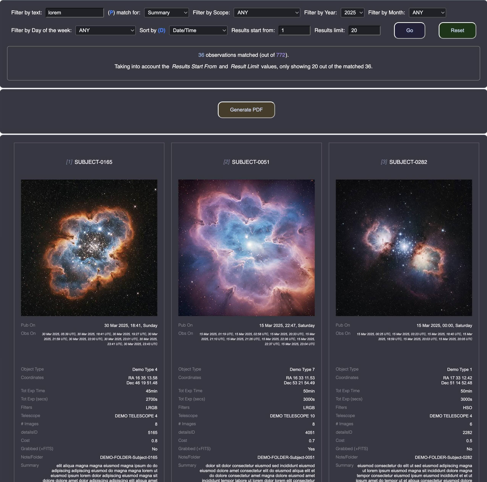

# Catalogue - Search, Filter and Report App

## Or how to process relatively big sets of collected structured data, and allow searching, sorting, filtering and displaying it.

### The story

This project was created as a coding fun and exercise, although it has a very practical purpose for me as well. I have been collecting over time large sets of metadata around astronomical observations, such as targets, coordinates, telescopes, time of observation, filters used, folders where I've kept and organised my files, as well as description of the targets and a lot more meta items for each of the thousands of observations. Since I have been automating the process of collecting that data (thanks to other of my coding projects for sideloading scripts locally, for me only, alongside live websites that I use), I ended up with large JSON file that stores the described metadata.

I created this project to solve a number of problems - mainly to be able to load up that large JSON file with metadata into a purposely built React application that can filter and sort the data based on number of UI selectable filters, and display subsets of that data in a manageable way in the browser.

I also built an image caching solution, with local cache storage for the images which urls are in the big metadata json, so that these don't load from the Internet every time I browse and filter my data using this app.

I also built and integrated a solution for generating good looking PDF reports/ebook from all the data for easy offline view and backup, using Node JS/Express Server and utilising the power of Puppeteer for the PDF rendering from produced HTML. See the `report/` folder for an example PDF.

The project runs on both Client side - React and Server side - NodeJS/Express, with the app performing API tasks from the server such as - checking if server is alive with time based token sent to and back (because why not :) ), caching of images (happens as soon as the app has confirmed the JSON file), dynamically generating lists of files and folders for each filtered and displayed observation, and providing static assets such as the cached images and additional files.

One important part of the Client/Server setup is the use of Web Worker in the Client to initiate the generation of a PDF (a long and time consuming process, hence it being offloaded to a Web Worker on the Client side), and subsequently checks if and when the PDF work is completed, displaying the elapsed time during its generating process as well as a summary of how long it's taken when it completes. It also provides a dynamic link to the produced PDF for easy use in the browser.

Technology wise, the app was bootstrapped with [Create React App](https://github.com/facebook/create-react-app), and uses a good number of components to distribute the focus and reuse of parts of the application. The client runs on localhost port 3000, and the server runs on localhost port 3050. I have a script that runs both of them using `npm run both` (which uses the dev tool `concurrently`).

The App starts by displaying an **Upload** component where the JSON file can be specified/loaded in the browser and its data made available to the **Filter** component. At this point the image _caching process_ is started with the help of the server, and a cached images object is made available to the app (if there are any new images that have not been cached yet, they would be downloaded and added to the cache). On the fly links to images within metadata loaded in the app, are replaced with ones from the cache, thus reducing drastically the load time later of the displayed result. The Filter component itself is made of reusable **Common Components** for _Input, Button and Select_.

Once the _filters_ in the app are all set, which also includes _searching_ for text within a number of different metadata types, as well as the _sorting_ by different fields in ascending or descending order, as well as limiting the results by starting point and number of items to show (_we don't want all thousands of items rendered in the view, after all this is what we have the search and filters for_), the **Results** container component picks up and the server is approached to go in specified local folders and look into subfolders (and their subfolders), matching a special field in the metadata - `note` which holds the folder name where I have stored my astronomical data, for each observation and produce a list of files and folders, thus enriching on the fly the displayed data in the result. Each observation is then rendered on the screen with the help of each **Result** (sub)component (of the container _Results_).

The state of the app is organised in such a way, that when a new Filter/Search is performed the Results would be unmounted/hidden and when the new data is ready, the new Results would show. In between there is of course a **Loading Indicator** component being used, which patiently awaits for the queue of all fetched requests to complete (thank you `Promise.all`!), before it hides to make way for the Results.

Once we have Results displayed, a new option to **Generate PDF** is made available, which engages a **Web Worker**, contacts the server to initiate the process for generating the PDF, and after that starts a timer which regularily checks a special API endpoint for the current status of the PDF process. When this work is completed, the timer clears, the worker becomes idle again and the result PDF is presented to the page in the form of link. Time is also displayed during and after the whole process, accounting for how long it has taken.

In an ideal world, everything would just work, right, but in real life this is not always the case :) As such I have designed the Client application to work in such a way that it can detect _if the server side is down_, and **_gracefully fallback_** into removing certain server dependand parts of the application (such as image cache, folder list and pdf generation) while allowing pretty much everything else - such as filtering, searching and sorting to **_continue working_** - i.e. dynamic reporting to the browser, just not into PDF. Images are loaded from the Internet, due to the lack of local cache store, but warnings are dynamically displayed if the filters would require a larger number of Result components, each with its image asset to load, trying to prevent too much data to be loaded from external sources.

Now, it would be unwise if I just shared on GitHub my personal folder names, or real astronomical data that I have collected from service providers, as such the information presented here has been **anonymised** and simplified to an extent suitable for public display. As such I've provided a much smaller sample data file with limited links to external assets.

_**The idea here was to demonstrate how large sets of data can be open, filtered, sorted, displayed and reported on with the help of React and NodeJS, so the ideas here can easily be adopted for use with other data structures with repeated items and their own fields and subfields, and associated image assets.**_

## Available Scripts

In the project directory, you can run:

### `npm start`

Runs the app in the development mode.\
Open [http://localhost:3000](http://localhost:3000) to view it in your browser.

The page will reload when you make changes.\
You may also see any lint errors in the console.

### `npm test`

Launches the test runner in the interactive watch mode.

## The Server part of the app is in the subfolder `server-api`

Once inside the `server-api` folder

### `npm start`

Would run the server and watch for changes using `nodemon`

The server would be listening on [http://localhost:3050](http://localhost:3050) to view it in your browser.

## To run with one command both client and server, while in the root of the app run

### `npm run both`

## Other folders to mention (_all based on project root base folder_)

### report/

This is where the generated PDF would be output (you will also have a link made available in the Client app once the PDF is ready, and it would be static asset served by Express so you can use it in full in the browser, but it is good to know where the physical file would be). The reports are time based, i.e. it would form part of the file name, such as YYYYMMDD-HHMMSS--report.pdf.

### image-cache/

This would be the folder where the locally stored images would be cached.

### data/

This is where your metadata JSON file that the App uses both in Client and Server **should be** placed. In the client app you point the browser to this folder and file, and due to browser security restrictions I can only pass the filename to the server and not the full file path, hence the Server is preconfigured to look into this folder for whichever dynamic filename is open by the Client. I did consider at one time to POST the whole content of the file to the Server so there is no need to know where to look, folder wise, but since we're talking about lots of MB of data (in my case), passing just the name reference seemed like the better approach.

### demo-folders/

This is where the server app looks into for matching observations and generating lists of files and folders.

This folder is a simplified and simulated version of my observations folder where I keep all files and subfolders for every observation. The Client app and the Server app generate dynamically list of files and folders for each observation as part of the reporting. I've provided a script (`generate-demo-folders.js`) in that folder that can generate dummy folders and files structure for every observation listed in the provided data/demo-data.json.

## Final notes

### App setup

Goes without saying, once checked out you would need to do `npm install` in both client (root of project) and server (in the `server-api` subfolder), before you run any app builds.

---

I hope you enjoy it and you find useful this setup and its approach to handling big sets of data. The rest you'll be able to see in the code itself ;)
